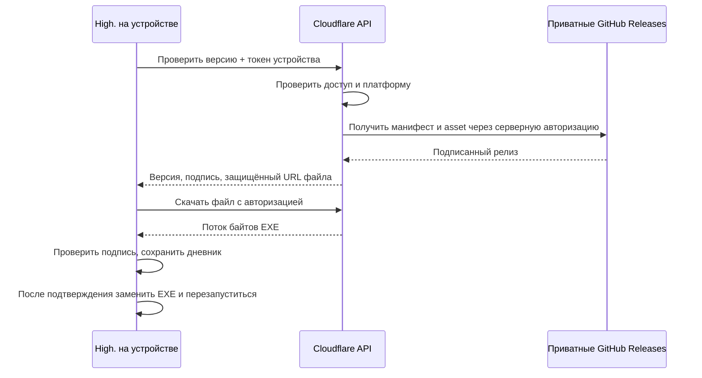

# High. — подготовка к 2.0

Обновление 04.10.2026: пользователь выбрал публичный GitHub. Windows 2.0.0 опубликован; реальный переход 1.9.23 → 2.0.0, автоматическая проверка и подсветка кнопки прошли. Отдельный приватный канал обновлений больше не требуется. Ниже сохранён прежний проект такого канала; актуальные доказательства и ограничения мобильной синхронизации — в AUDIT-2.0.md.

Дата: 27.09.2026. Это план реализации и условия выпуска, а не заявление о готовности 2.0.

## Что уже есть

- Windows-приложение Tauri, один EXE без setup, локальный дневник и резервные копии.
- Проверка подписанного EXE и замена после подтверждения. Прежний сквозной тест обновления проходил до приватизации GitHub.
- Cloudflare Worker + D1: зашифрованные AES-GCM снимки графиков, авторизация, ревизии и отказ при конфликте.
- Ручная синхронизация через файл сопряжения. Ключ шифрования не отправляется серверу.

Сейчас приватный GitHub не отдаёт клиенту без авторизации `latest.json` (27.09 проверен HTTP 404). `/v1/health` сервера синхронизации отвечает, но health-check не доказывает обмен на реальном телефоне. Текущая синхронизация не распространяет удаление целого графика и не является фоновой синхронизацией всей библиотеки.

## Обновления через приватный GitHub

Выбранный вариант сохраняет закрытыми и исходники, и файлы приложения:

1. Релиз по тегу строится в GitHub Actions. Windows публикует только EXE, `.sig`, `latest.json`. Настроенный checkout должен работать с приватным репозиторием. В 2.0 `package.json`, `appVersion`, Cargo и Tauri используют одну версию `2.0.0`.
2. Отдельные маршруты Worker `/v2/updates/...` проверяют право конкретного устройства скачивать приложение. Доступ к обновлениям не должен требовать согласия на загрузку личного дневника.
3. GitHub App installation token с `Contents: read` хранится и обновляется только на сервере. Для закрытого пилота допустим отдельный ограниченный серверный token. В EXE, JS, QR и файле сопряжения GitHub-token отсутствует.
4. Сервер получает только разрешённые assets конкретного репозитория/тега/платформы через GitHub API. Не принимает произвольный URL от клиента. Обрабатывает ответ 200 и redirect 302; GitHub Authorization не пересылается на другой host. Клиенту отдаёт поток после проверки доступа, а не публичную ссылку без защиты.
5. Desktop updater получает токен устройства из защищённого хранилища. Меняются endpoint, заголовки запросов и нынешняя строгая проверка URL в `portable_update.rs`; разрешается только выбранный HTTPS-host обновлений. Подпись и подписанная версия остаются обязательными.
6. Проверки перед выпуском: неверная подпись/версия, отозванное устройство, оборванная загрузка, read-only папка, повреждённый staging-файл, отказ запуска новой версии, откат, сохранность дневника. Ошибка сети не должна отображаться как «последняя версия».
7. Переход со старых клиентов потребует однократной ручной замены EXE: текущий клиент с приватным URL не сможет сам получить новый updater. Менять публичный ключ без отдельного плана миграции нельзя.

Источники: [GitHub Release Assets API](https://docs.github.com/en/rest/releases/assets), [Tauri Updater](https://v2.tauri.app/plugin/updater/).

## Синхронизация устройств

Для первой 2.0 — прозрачный обмен зашифрованными снимками с явными конфликтами. Автоматическое объединение одновременно изменённых записей не включать до отдельной проверки: текущие `revision` и `order` локальны и не являются глобальными версиями записей.

1. Пользователь включает синхронизацию сам. На доверенном устройстве создаётся одноразовое приглашение на 5 минут; новый телефон сканирует QR и подтверждается на первом устройстве. Ключ дневника передаётся в зашифрованном виде через секрет приглашения, не хранится сервером открыто. До реализации этого потока остаётся ручной файл сопряжения.
2. У каждого устройства отдельный отзываемый токен. Сервер хранит его hash, account ID, device ID и статус. Отзыв запрещает будущие запросы, но не удаляет уже скачанные локальные копии. Ключ шифрования и recovery-код независимы от токенов доступа.
3. Ключи хранятся через нативное защищённое хранилище: Windows DPAPI/Credential Manager, Android Keystore, macOS Keychain. Текущий localStorage — ограничение прототипа; нужна миграция с проверкой, что ключ действительно сохранён, прежде чем удалять прежнюю копию.
4. Сначала сохраняется локальная запись и устойчивая очередь отправки. Затем отправка после короткой паузы, при возврате приложения на экран и после восстановления сети. Повторные запросы используют operation ID; задержки повторов растут, очередь привязана к аккаунту и графику. Выход из аккаунта не отправляет его очередь другому аккаунту.
5. Сервер делает compare-and-swap по серверной ревизии. Клиент отмечает успех только после проверки ID и ожидаемой новой ревизии. Потерянный ответ после PUT требует чтения актуального снимка, а не слепой повторной перезаписи.
6. При одновременных правках сохраняются обе версии и показывается выбор. Ни время на телефоне, ни «последний запрос» не выбирают победителя автоматически. Перед применением облачной версии повторно проверяется, что текущий график/ревизия не изменились за время запроса.
7. Синхронизируется вся выбранная библиотека графиков, включая отметки удаления. Для удаления графика нужен отдельный протокол tombstone и явное восстановление; старое устройство не должно воскрешать удалённый график. Удаление приложения на телефоне не означает удаление облачных данных.
8. Цены, свечи, сглаживание, объём и стартовый ритм вычисляются на устройстве из записей. Производные кадры и промежуточные анимации не отправляются как события. Сохраняются исходные даты/время/часовой пояс; нужны тесты DST и двух разных часовых поясов.
9. Текущий сервер принимает максимум 1 800 000 байт тела запроса. До отправки проверяется размер уже зашифрованного payload. При превышении — понятное сообщение и экспорт, локальная запись сохраняется. Обмен больших дневников потребует отдельного протокола частей/manifest; нельзя обещать поддержку 100 000 записей одним запросом.
10. Совместимость: версия протокола и схема дневника проверяются до записи. Старый клиент при неизвестной схеме требует обновления и сохраняет свои файлы. Перед миграцией — локальный backup, для сервера — проверенный путь восстановления зашифрованных данных.

## Что проверить на мобильном устройстве

Браузер шириной 390 px проверяет вёрстку, но не Android WebView, системную клавиатуру, файловые диалоги, фоновые ограничения или установку APK. Android CI также доказывает только сборку.

- Чистая установка подписанного тестового APK; создание записи; закрытие/force-stop; повторный запуск.
- Русская/английская клавиатура, десятичная запятая, `-0.2`, ввод текста после числа, дата и время, кнопка Back, экранная клавиатура и поворот.
- Touch-перемещение/масштаб графика, Auto блокирует вертикаль; рисование в будущем; объём отделён от цены.
- Системный выбор файла, экспорт/импорт и резервное восстановление.
- Windows ↔ Android: первая отправка, скачивание, правки по очереди, одновременно и офлайн, удаление/восстановление, смена графика во время запроса, просроченное приглашение и отозванное устройство.
- Разрыв сети до/после PUT, перезапуск до подтверждения, неверный ключ, переполненное хранилище, сервер 401/409/413/429/500.
- Обновление APK поверх предыдущего с тем же application ID и release signing key, сохранение дневника. Стандартный desktop updater Tauri не поддерживает Android: для APK нужен отдельный сценарий системной установки с подтверждением; debug APK не является релизом.

## Условия выпуска

Windows можно выпускать раньше мобильных платформ, если мобильные проверки ещё не завершены. Для 2.0 нужны: проверенный приватный канал обновлений на двух реальных версиях; обмен Windows ↔ физический Android; защищённые ключи; подтверждённое восстановление после конфликта/сбоя; подписанные платформенные сборки. Linux/macOS должны пройти сборку и запуск на своих ОС. До этих проверок мобильная готовность и рабочее автообновление из приватного GitHub не заявляются.
